DropSpot Case Study

Proje Özeti

DropSpot, kullanıcıların ve adminlerin drop (kampanya/ürün) listelerini yönetebildiği bir Next.js + Tailwind CSS web uygulamasıdır.
Projenin amacı, modern frontend teknolojileri kullanarak CRUD işlemleri, token tabanlı authentication, ve responsive tasarım içeren bir admin paneli ve kullanıcı login akışı tasarlamaktır.

Kullanılan Teknolojiler
Katman	Teknoloji
Frontend	Next.js 16 (App Router), React 18
UI & Styling	Tailwind CSS
HTTP İstekleri	Axios
State Management	React Hooks (useState, useEffect)
Build Tools	Turbopack / PostCSS / Tailwind CLI
Özellikler
Kullanıcı Login

Email & şifre ile giriş

Hatalı girişlerde kullanıcıya hata mesajı

Login sırasında loading spinner ve buton disable

Başarılı giriş sonrası token localStorage’a kaydediliyor

Admin Panel

Token tabanlı authentication

Drops CRUD (Create, Read, Update, Delete)

Token geçerlilik kontrolü ve süresi dolan token ile login yönlendirmesi

Responsive ve modern UI (Tailwind CSS ile tasarlandı)

Uygulama Akışı
flowchart TD
    A[Kullanıcı Login] --> B{Token Geçerli mi?}
    B -->|Evet| C[Drop Listesi Görüntüleme]
    B -->|Hayır| D[Login Sayfasına Yönlendirme]
    C --> E[Drop Oluşturma]
    C --> F[Drop Güncelleme]
    C --> G[Drop Silme]

Kullanıcı /login sayfasından giriş yapar.

Admin /admin/login sayfasından giriş yapar.

Başarılı login sonrası token alınır ve localStorage’a kaydedilir.

Admin panelinde drop listesi görüntülenir, yeni drop eklenebilir, var olan drop güncellenebilir veya silinebilir.

Token geçerliliği kontrol edilerek kullanıcı güvenliği sağlanır.

Teknik Detaylar
API Yapısı

utils/api.js içinde axios ile basit HTTP client oluşturuldu

Admin ve kullanıcı tarafı ayrı API çağrılarıyla yönetildi

Tailwind CSS Entegrasyonu

Global stil (app/globals.css):

@tailwind base;
@tailwind components;
@tailwind utilities;

body {
  margin: 0;
  font-family: system-ui, sans-serif;
  background-color: #f9fafb;
}

Component bazlı stil: Tailwind sınıfları ile responsive tasarım

Admin Dashboard Örnek Kod
const api = axios.create({ baseURL: 'http://localhost:3000' });

const fetchDrops = async () => {
  const res = await api.get("/drops");
  setDrops(res.data);
};

Kurulum
git clone <repo-url>
cd DropSpot/frontend
npm install
npm run dev
cd DropSpot/backend
node src/server.js

önce backend çalıştırılmalı sonra frontend
Local: http://localhost:3000

Dev server Turbopack kullanıyor, gerekirse NEXT_DISABLE_TURBOPACK=1 ayarlanabilir

Zorluklar ve Çözümler

Turbopack ve Tailwind CSS hataları → PostCSS konfigürasyonu ve @tailwindcss/postcss ile çözüldü

adminApi import hataları → Axios ile client oluşturularak çözüldü

Production build hataları → App Router ve default export React component düzenlendi

Öğrenilenler ve Kazanımlar

Next.js 16 App Router ile component ve page yönetimi

Tailwind CSS ile modern responsive UI tasarımı

JWT token tabanlı authentication ve localStorage kullanımı

CRUD işlemleri ve API yönetimi

Turbopack ve PostCSS konfigürasyonu ile frontend build süreci yönetimi

Gelecek Geliştirme Planları

Backend ile gerçek veri entegrasyonu (Node.js + Express + MongoDB/PostgreSQL)

Admin ve kullanıcı rolleri için detaylı yetkilendirme

Responsive UI iyileştirmeleri ve dark mode

JWT refresh token ve logout mekanizması

Zorluklar ve Çözümler

Turbopack ve Tailwind CSS hataları → PostCSS konfigürasyonu ile çözüldü

adminApi import hataları → Axios client ile çözüldü

Production build hataları → App Router ve default export React component düzenlendi

Öğrenilenler

Next.js 16 App Router ile component ve page yönetimi

Tailwind CSS ile modern responsive UI

JWT token tabanlı authentication ve localStorage kullanımı

CRUD işlemleri ve API yönetimi

Gelecek Geliştirme Planları

Backend ile gerçek veri entegrasyonu (Node.js + Express + MongoDB/PostgreSQL)

Admin ve kullanıcı rolleri için yetkilendirme

Responsive UI iyileştirmeleri ve dark mode

JWT refresh token ve logout

POSTMAN OVERVIEW 
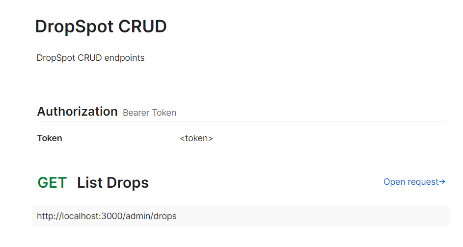
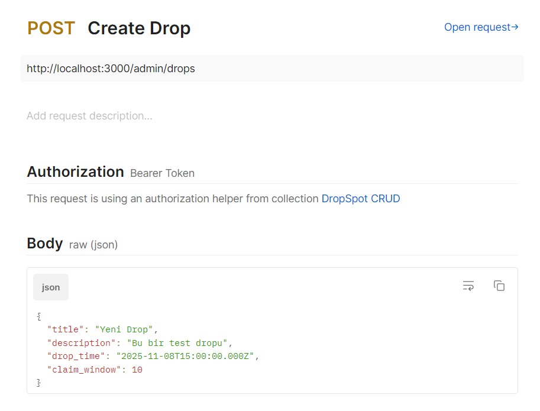
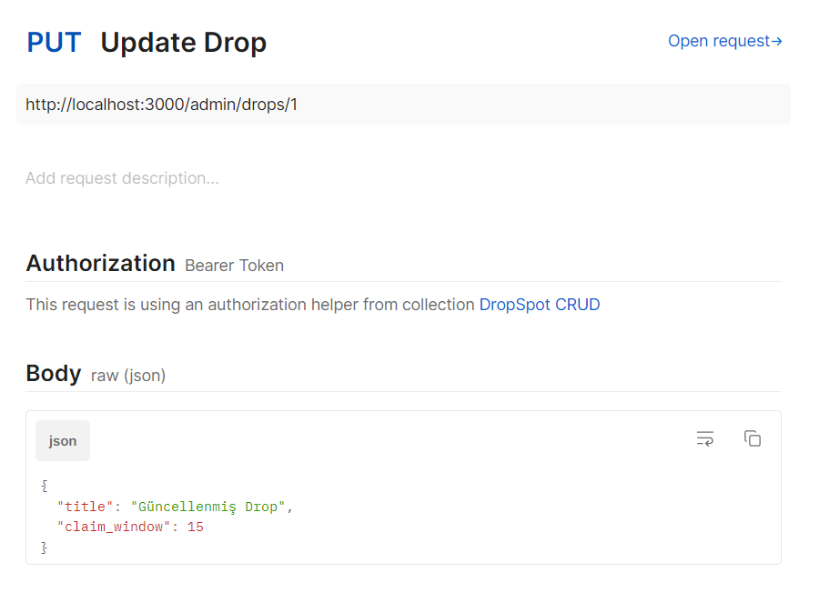
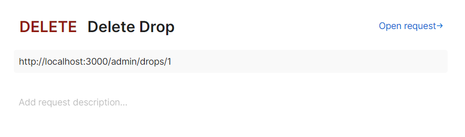
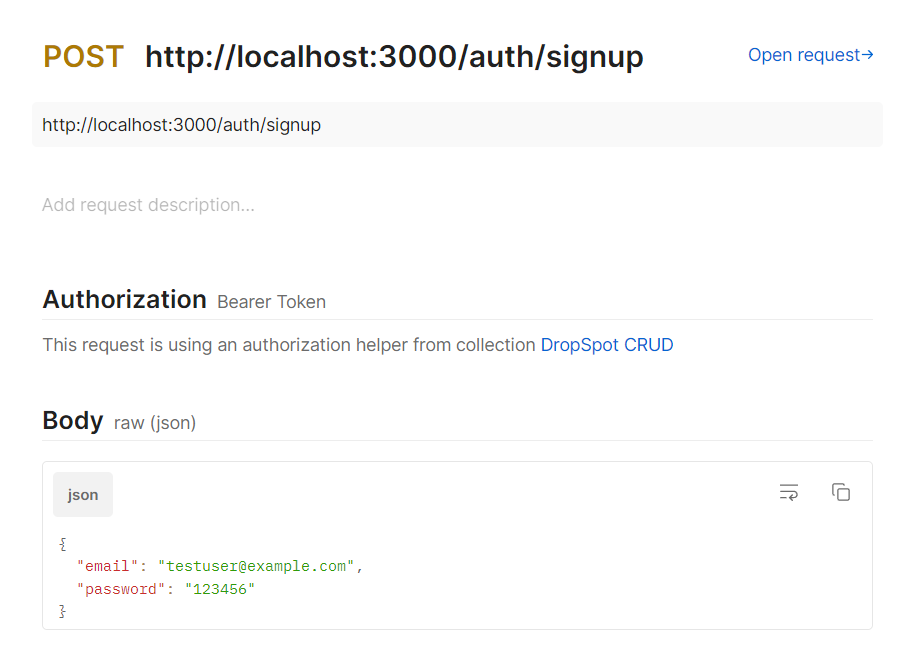
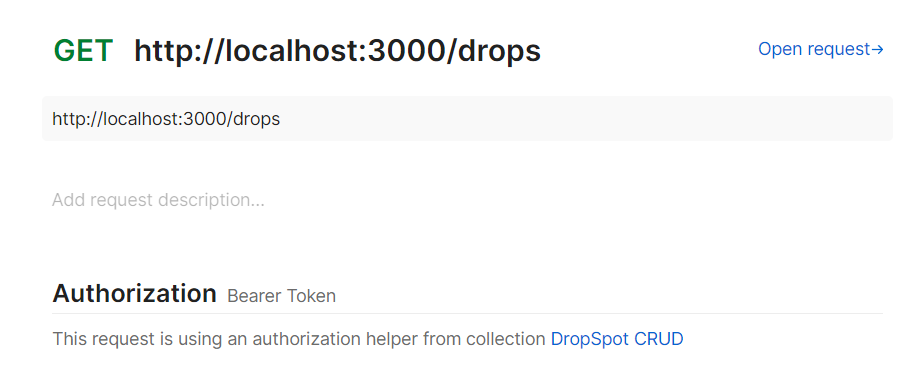
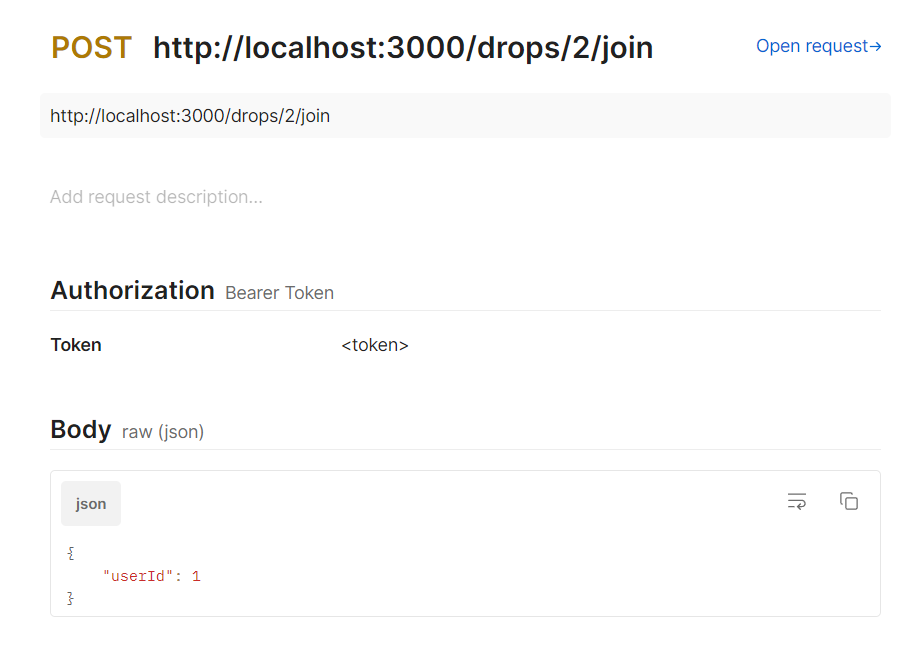
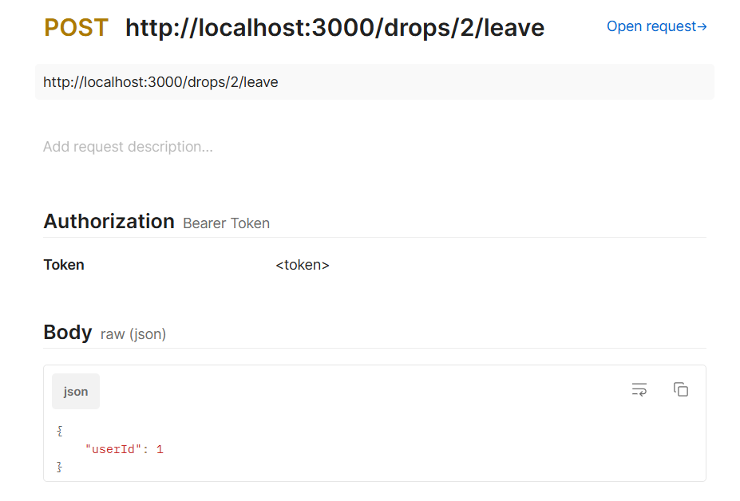
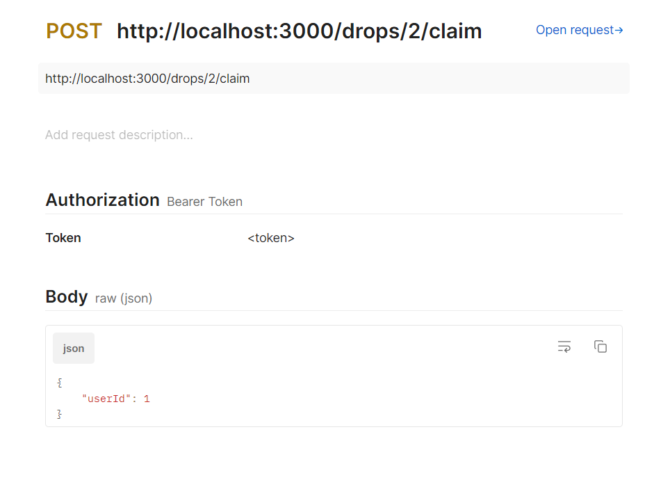

FRONTEND GÖRÜNTÜLERİ
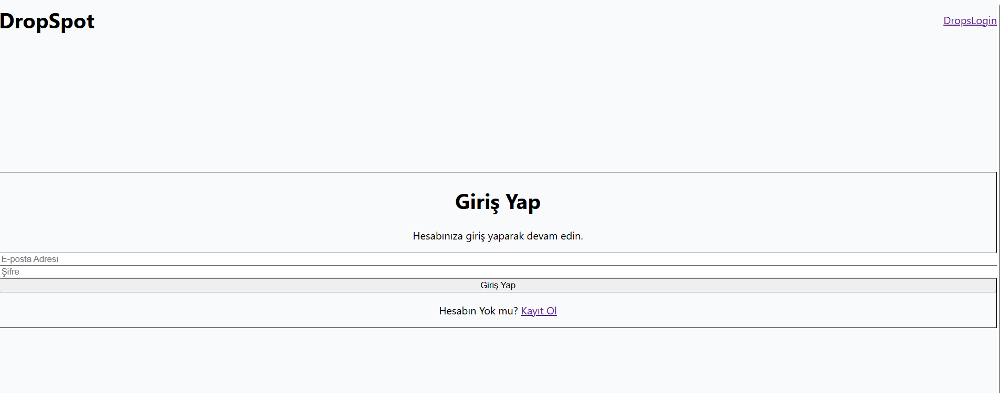
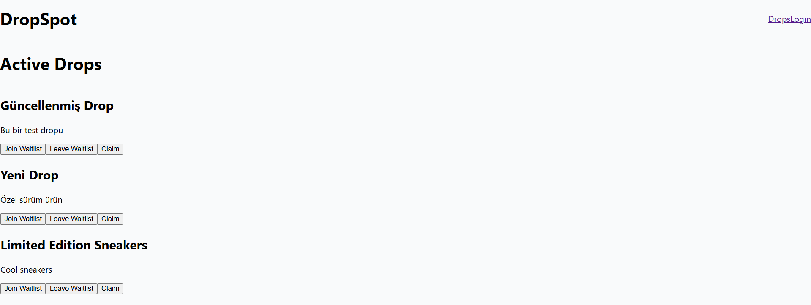
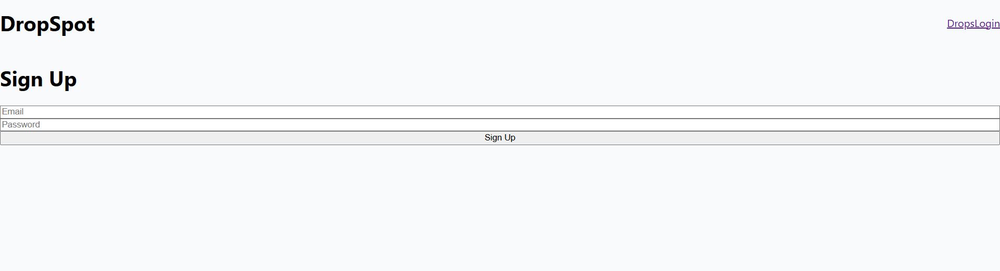
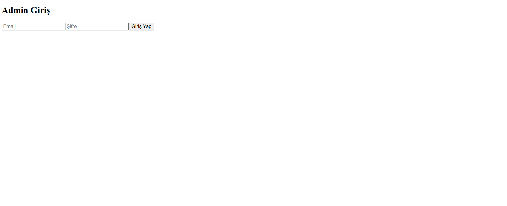
